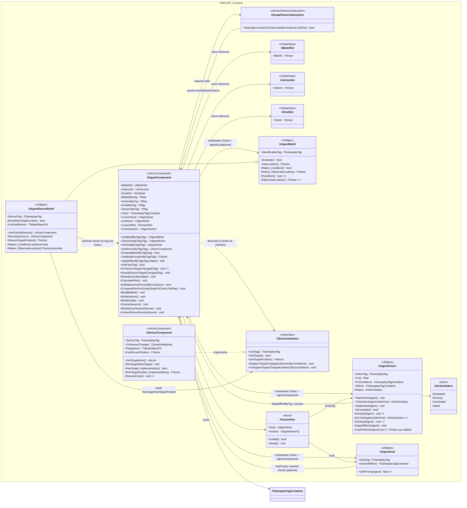

# KMGoap
GOAP Plugin to allow better AI Authoring and smarter agents with less effort

```mermaid
classDiagram
    direction LR

    %% ==========================================================
    %% HIGH-LEVEL FLOW (runtime)
    %% ==========================================================
    UAgentComponent --> UGoapPlannerSubsystem : requests plan
    UGoapPlannerSubsystem --> UAgentComponent : queries facts/beliefs/actions

    UAgentComponent --> UBeliefSet : owns reference
    UAgentComponent --> UActionSet : owns reference
    UAgentComponent --> UGoalSet : owns reference

    UAgentComponent --> UAgentBelief : instantiates (Outer = AgentComponent)
    UAgentComponent --> UAgentAction : instantiates (Outer = AgentComponent)
    UAgentComponent --> UAgentGoal : instantiates (Outer = AgentComponent)

    UAgentComponent --> USensorInterface : discovers & binds via interface
    USensorComponent ..|> USensorInterface : implements

    UAgentSensorBelief --> UAgentComponent : resolves sensor by tag (via Outer)
    UAgentSensorBelief --> USensorInterface : reads HasTarget/GetTargetPosition

    UAgentAction --> UAgentComponent : ApplyEffectByTag / queries
    UAgentGoal --> UAgentComponent : GetPriority / desired checks (planner)

    FActionPlan --> UAgentGoal : Goal
    FActionPlan --> UAgentAction : Actions[]


    %% ==========================================================
    %% RUNTIME MODULE (implemented code)
    %% ==========================================================
    namespace KMGOAP_Runtime {

        class EActionStatus {
            <<enum>>
            NotStarted
            Running
            Succeeded
            Failed
        }

        class FActionPlan {
            <<struct>>
            +Goal : UAgentGoal*
            +Actions : UAgentAction*[]
            +IsValid() bool
            +Reset() void
        }

        class UBeliefSet {
            <<UDataAsset>>
            +Beliefs : TArray<TSoftClassPtr<UAgentBelief>>
        }

        class UActionSet {
            <<UDataAsset>>
            +Actions : TArray<TSoftClassPtr<UAgentAction>>
        }

        class UGoalSet {
            <<UDataAsset>>
            +Goals : TArray<TSoftClassPtr<UAgentGoal>>
        }

        class UAgentBelief {
            <<UObject>>
            +IdentificationTag : FGameplayTag
            +Evaluate() bool
            +GetLocation() FVector
            #Native_Condition() bool
            #Native_ObservedLocation() FVector
            #Condition() bool <<BlueprintNativeEvent>>
            #ObservedLocation() FVector <<BlueprintNativeEvent>>
        }

        class UAgentSensorBelief {
            <<UObject>>
            #SensorTag : FGameplayTag
            #bUseRawTargetLocation : bool
            #CachedSensor : TWeakObjectPtr<UActorComponent>
            +GetCachedSensor() UActorComponent*
            #ResolveSensor() UActorComponent*
            #SensorTargetPosition() FVector
            #Native_Condition() bool (override)
            #Native_ObservedLocation() FVector (override)
        }

        class UAgentAction {
            <<UObject>>
            +ActionTag : FGameplayTag
            +Cost : float
            +Preconditions : FGameplayTagContainer
            +Effects : FGameplayTagContainer
            +StartAction(Agent) void
            +TickAction(Agent,DeltaTime) EActionStatus
            +StopAction(Agent) void
            +IsComplete() bool
            #Status : EActionStatus
            #OnStart(Agent) void <<BlueprintNativeEvent>>
            #OnTick(Agent,DeltaTime) EActionStatus <<BlueprintNativeEvent>>
            #OnStop(Agent) void <<BlueprintNativeEvent>>
            #ApplyEffects(Agent) void
            #CanPerform(Agent) bool <<BlueprintNativeEvent>> %% (as you added)
        }

        class UAgentGoal {
            <<UObject>>
            +GoalTag : FGameplayTag
            +DesiredEffects : FGameplayTagContainer
            +GetPriority(Agent) float <<BlueprintNativeEvent or C++>>
        }

        class UAgentComponent {
            <<UActorComponent>>
            +BeliefSet : UBeliefSet*
            +ActionSet : UActionSet*
            +GoalSet : UGoalSet*
            +BeliefsByTag : TMap<Tag,UAgentBelief*>
            +ActionsByTag : TMap<Tag,UAgentAction*>
            +GoalsByTag : TMap<Tag,UAgentGoal*>
            +SensorsByTag : TMap<Tag,UActorComponent*>
            +Facts : FGameplayTagContainer

            +GetBeliefByTag(Tag) UAgentBelief*
            +GetActionByTag(Tag) UAgentAction*
            +GetGoalByTag(Tag) UAgentGoal*
            +GetSensorByTag(Tag) UActorComponent*

            +EvaluateBeliefByTag(Tag) bool
            +GetBeliefLocationByTag(Tag) FVector
            +ApplyEffectByTag(Tag,bValue) void
            +GetFact(Tag) bool

            +CurrentGoal : UAgentGoal*
            +LastGoal : UAgentGoal*
            +CurrentPlan : FActionPlan
            +CurrentAction : UAgentAction*

            #OnSensorTargetChanged(Tag) void <<BlueprintNativeEvent>>
            #HandleSensorTargetChanged(Tag) void
            #ResetExecutionState() void
            #CalculatePlan() void
            #ValidateActionPreconditions(Action) bool
            #ComputePlanForGoals(GoalsToCheck,OutPlan) bool
            #BuildBeliefs() void
            #BuildActions() void
            #BuildGoals() void
            #CacheSensors() void
            #BindSensorEvents(Sensor) void
            #UnbindSensorEvents(Sensor) void
        }

        class UGoapPlannerSubsystem {
            <<UGameInstanceSubsystem>>
            +Plan(Agent,GoalsToCheck,MostRecentGoal,OutPlan) bool
        }

        class USensorInterface {
            <<UInterface>>
            +GetTag() FGameplayTag
            +HasTarget() bool
            +GetTargetPosition() FVector
            +RegisterTargetChangedListener(Obj,FuncName) void
            +UnregisterTargetChangedListener(Obj,FuncName) void
        }

        class USensorComponent {
            <<UActorComponent>>
            +SensorTag : FGameplayTag
            +OnSensorChanged : DynamicMulticast
            +GetTargetActor() AActor*
            #TargetActor : TWeakObjectPtr<AActor>
            #LastKnownPosition : FVector
            #SetTarget(NewTarget) void
            #HasTarget_Implementation() bool
            #GetTargetPosition_Implementation() FVector
            #DrawGizmos() void <<BlueprintNativeEvent>>
        }
    }

    %% ==========================================================
    %% NOTES (relationships inside namespace)
    %% ==========================================================
    UAgentSensorBelief --|> UAgentBelief
    UAgentComponent --> FActionPlan
    UAgentAction --> EActionStatus
    UAgentComponent --> FGameplayTagContainer : Facts
```
